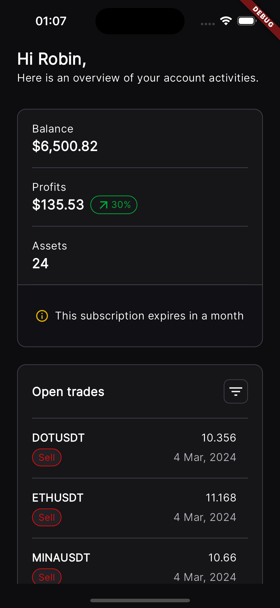
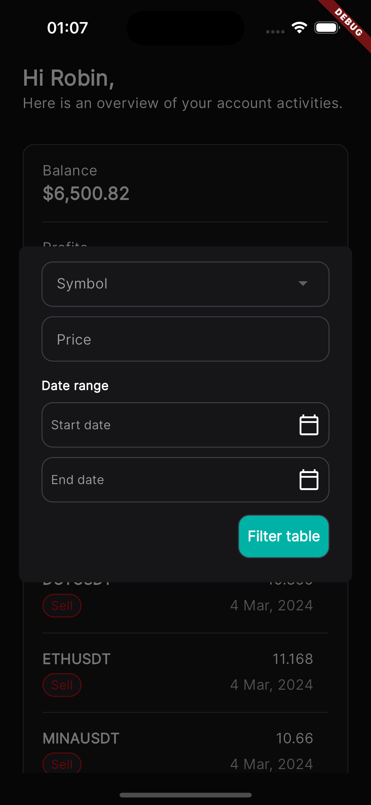

# Predictiva Orders

## Features

- **Summary View**: Users can view their balance, profits and assets.
- **Orders**: The app fetches the orders of the users and shows them in a paginated table view.
- **Filter**: It gives an option to the users to filter the orders based on the symbol, price and a date range.

## Installation

1. Clone the repository.
2. Navigate to the project directory.
3. Run `flutter pub get` to install dependencies.
4. Connect a device or emulator.
5. Run `flutter run` to launch the app.

## Screenshots

## Technologies Used

- Flutter
